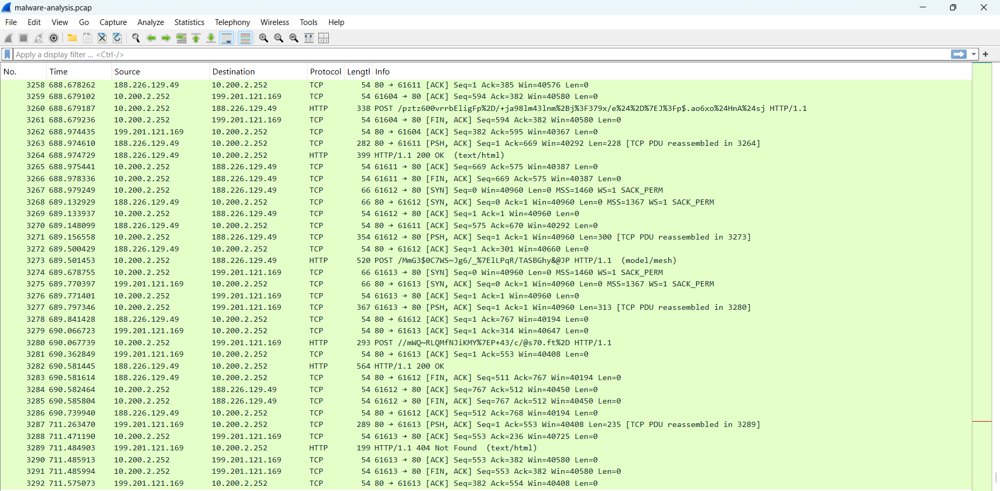
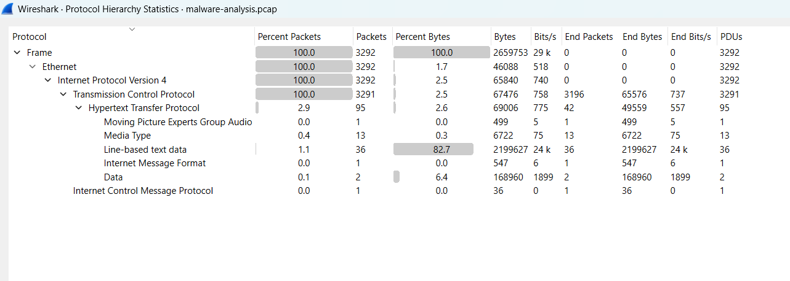
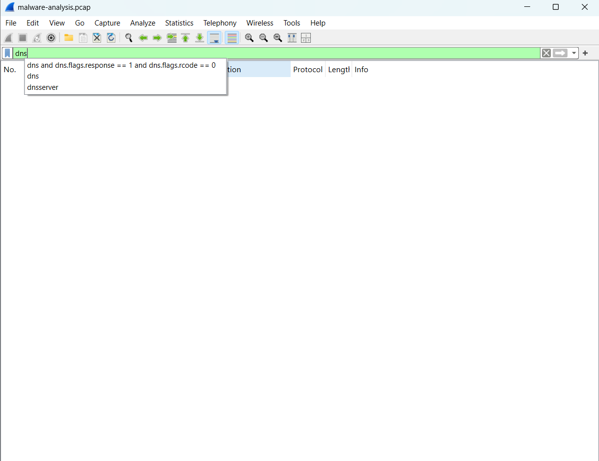
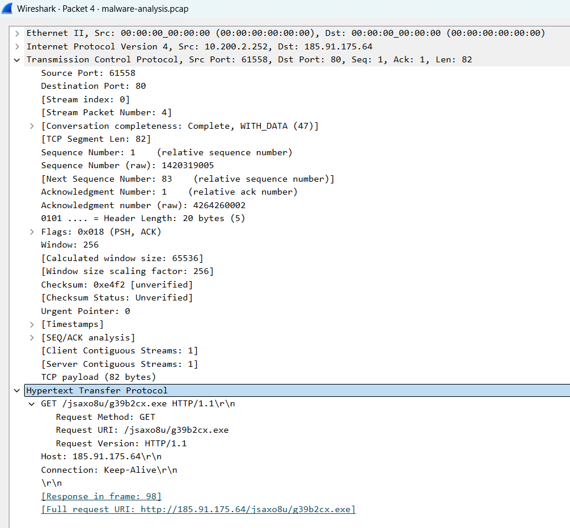
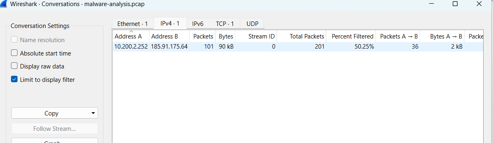
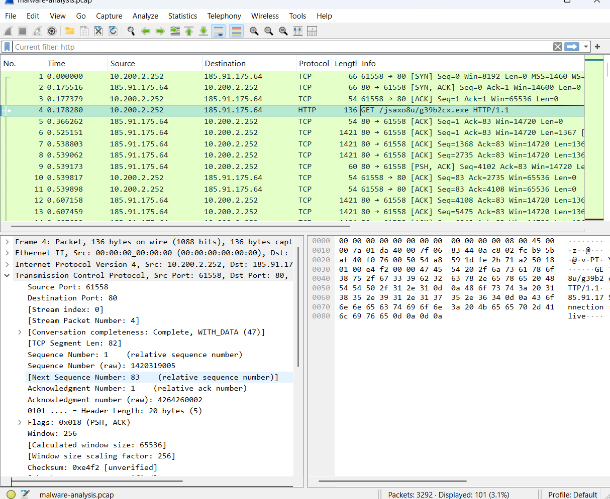

# Wireshark Malware Traffic Analysis

## Project Overview
This project focuses on analyzing suspicious network traffic using Wireshark to identify potentially malicious activity, suspicious HTTP communication, executable payload delivery and network-based indicators of compromise (IOCs).
The investigation involved protocol analysis, TCP stream reconstruction, packet inspection, HTTP object analysis and IOC documentation using a malware traffic capture file.

# Objectives
- Analyze suspicious packet capture (PCAP) traffic
- Investigate HTTP-based communication
- Identify suspicious executable downloads
- Perform TCP stream reconstruction
- Extract indicators of compromise (IOCs)
- Understand malware traffic behavior

# Tools Used
- Wireshark
- Protocol Hierarchy Statistics
- TCP Stream Analysis
- HTTP Object Export
- Packet Inspection Filters

# Skills Demonstrated
- Network Traffic Analysis
- Malware Traffic Investigation
- Packet Inspection
- Protocol Analysis
- IOC Identification
- HTTP Traffic Investigation
- TCP Stream Reconstruction
- Security Documentation

# Investigation Steps
## 1. Initial Traffic Inspection
The packet capture file was opened in Wireshark to observe:
- Packet count
- Active protocols
- Source and destination communication
- Overall traffic behavior

## 2. Protocol Hierarchy Analysis
Protocol hierarchy statistics were analyzed to identify dominant protocols within the capture.
Observed protocols included:
- TCP
- HTTP
- DNS
- IPv4
TCP was identified as the dominant protocol.

## 3. DNS Analysis
DNS traffic was inspected to identify domain-based communication patterns.
Minimal DNS activity was observed, suggesting possible direct IP communication.

## 4. HTTP Traffic Analysis
HTTP traffic inspection revealed suspicious executable download activity.
Suspicious request identified:
```http
GET /jsaxo8u/g39b2cx.exe HTTP/1.1
```
Observations:
- Executable payload download
- Direct IP communication
- Randomized filename
- Unencrypted HTTP transfer

## 5. TCP Stream Reconstruction
TCP stream analysis reconstructed the communication between systems and revealed executable payload content.
Observed indicator:
```text
This program cannot be run in DOS mode
```
This suggested Windows executable file transfer behavior.

## 6. HTTP Object Analysis
HTTP objects were exported to identify transferred files associated with suspicious communication.
Binary payload delivery behavior was observed during analysis.

## 7. Packet Inspection
Detailed packet inspection confirmed:
- HTTP communication over port 80
- Executable payload transfer
- External host communication
- Suspicious request behavior

# Indicators of Compromise (IOCs)

 Type                Value                        Observation 
 External IP         185.91.175.64                Suspicious communication host 
 Executable File     g39b2cx.exe                  Potential malicious payload 
 Protocol            HTTP                         Unencrypted communication 
 Content-Type        application/octet-stream    Binary executable transfer 
 HTTP Request        GET /jsaxo8u/g39b2cx.exe    Suspicious payload request 

# Screenshots Included
- Opened PCAP Analysis
- Protocol Hierarchy Statistics
- DNS Analysis
- HTTP Analysis
- TCP Stream Reconstruction
- Exported HTTP Objects
- IP Conversations
- Packet Details
- IOC Documentation

# Project Structure
```bash
wireshark-network-analysis/
│
├── screenshots/
├── reports/
├── pcap-files/
└── README.md
```
---

# Key Findings
The investigation revealed several suspicious indicators consistent with potential malware delivery activity, including:
- Suspicious HTTP communication
- Executable payload transfer
- Binary content delivery
- Direct IP communication
- Suspicious external host interaction

# Conclusion
This project demonstrated the use of Wireshark for malware traffic analysis, packet inspection, TCP stream reconstruction, IOC extraction, and suspicious network activity investigation.
The analysis workflow simulated real-world SOC and DFIR investigation techniques used to identify potentially malicious network behavior.

# Report
Detailed findings are available in the investigation report located in the `final-doc.pdf`.

#Screenshots
## Opened PCAP File


## Protocol Hierarchy Analysis


## DNS Analysis


## HTTP Traffic Analysis


## TCP Stream Reconstruction


## Exported HTTP Objects


## IP Conversations Analysis


## Packet Details Inspection


## IOC Documentation

